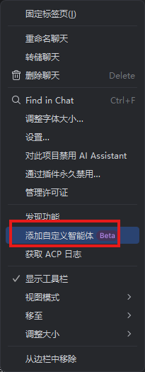
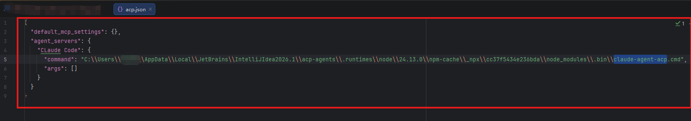
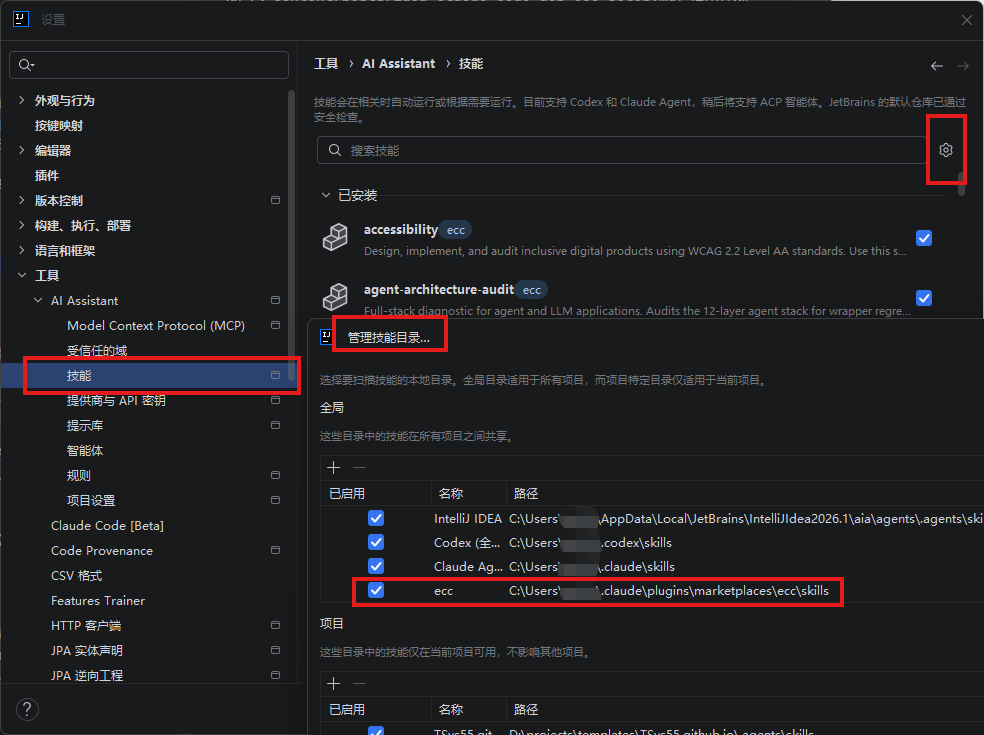
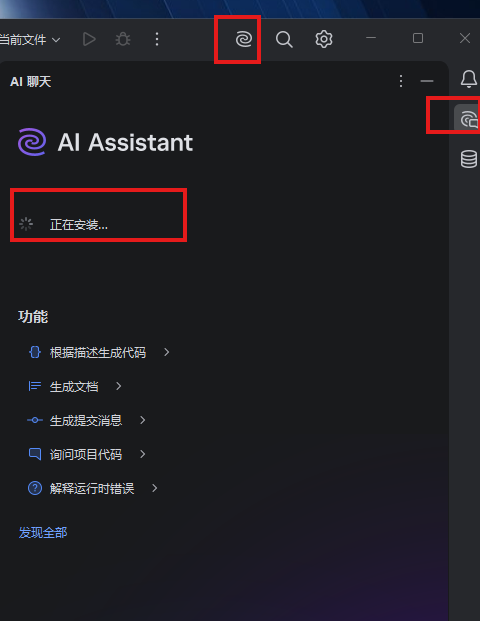
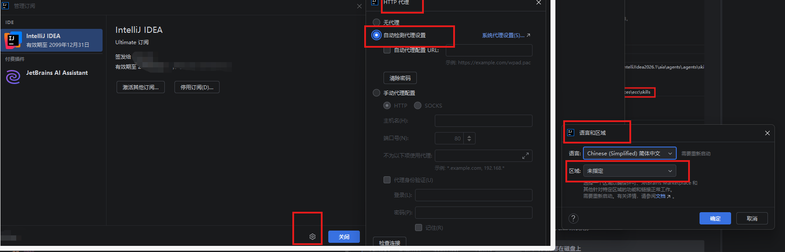
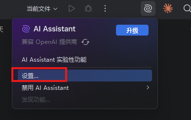
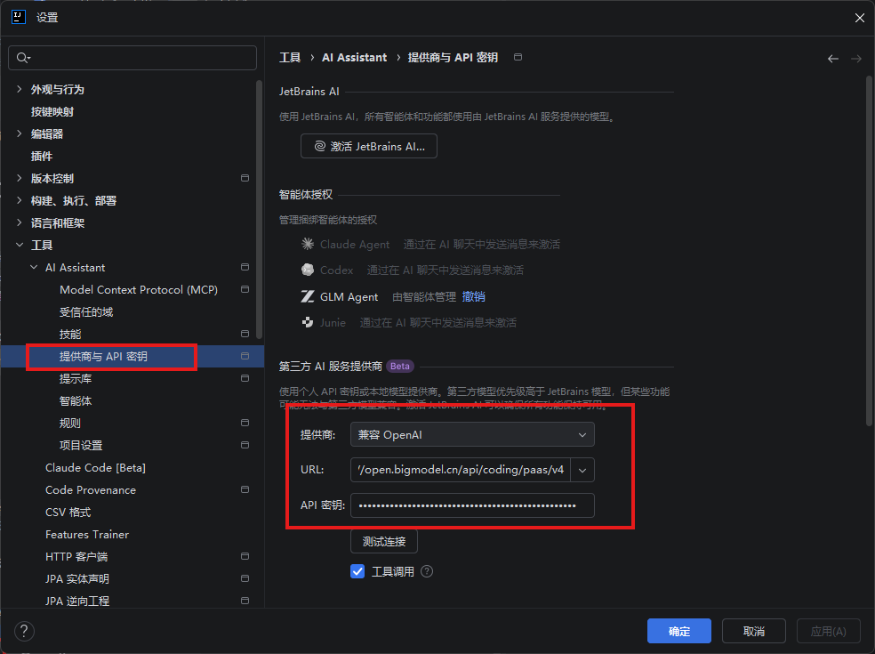

## 背景

我平时用 JetBrains IDEA 写代码，又重度依赖 Claude Code（下文简称 CC）以及它生态里的 **ECC（Everything Claude Code）**
插件——后者带了几百个开箱即用的 skill、斜杠命令和 hook。终端里用 CC 一切正常，但我想直接在 IDEA 的 AI 助手（AI Assistant，下文称
AIA）面板里驱动 CC，省得来回切窗口。

这一路踩了个挺隐蔽的坑：CC 和 ECC 在本地都装得好好的，可一旦改成从 IDEA 里调用，ECC 的 skill 和斜杠命令就全部"失联"
。这篇文章记录完整的配置过程，以及那个坑是怎么排查出来的。

## 整体架构

最终跑通的是这样一条链路：

```
IDEA AIA（客户端）  →  ACP 协议  →  claude-agent-acp（适配器）  →  Claude Code（真正的 agent）  →  API 代理  →  大模型
```

> Claude Code 本身不会说 ACP 协议，中间需要 `claude-agent-acp` 适配器把它包装成 ACP agent，IDEA 才驱动得了（详见第二步）。

几个关键点先说清楚：

- **ACP（Agent Client Protocol）** 只是 IDEA 和 CC 之间的通信协议。接进去之后，真正干活的还是本机那个 CC 进程，IDEA
  只相当于一个"前端皮肤"。
- **后端模型不一定是 Anthropic 的 Claude**。CC 支持把 `ANTHROPIC_BASE_URL` 指向任何兼容 Anthropic API 格式的端点。我接的是智谱
  GLM 的兼容端点，所以实际推理用的是 GLM——但 CC 的所有 harness 能力（工具、skill、hook、插件）照常工作，因为这些全是 CC **客户端层
  **的特性，跟后端用哪个模型无关。
- **ECC 是个第三方插件**，通过 CC 的插件 marketplace 安装。

## 第一步：配置本地 Claude Code（接 GLM 代理）

CC 的用户级配置在 `~/.claude/settings.json`。核心是这几个环境变量：

```json
{
  "env": {
    "ANTHROPIC_AUTH_TOKEN": "<你的 token>",
    "ANTHROPIC_BASE_URL": "https://open.bigmodel.cn/api/anthropic",
    "ANTHROPIC_DEFAULT_HAIKU_MODEL": "glm-4.7",
    "ANTHROPIC_DEFAULT_SONNET_MODEL": "glm-5.2",
    "ANTHROPIC_DEFAULT_OPUS_MODEL": "glm-5.2",
    "API_TIMEOUT_MS": "3000000"
  }
}
```

说明：

- `ANTHROPIC_BASE_URL` 指向智谱 BigModel 的 Anthropic 兼容端点；
- 三个 `*_MODEL` 把 CC 内部的 sonnet / opus / haiku 三档分别映射到具体的 GLM 模型（`[1m]` 表示百万级上下文版本，按需选用）；
- `ANTHROPIC_AUTH_TOKEN` 是敏感信息，**千万别提交进 git**——这个文件在 `~/.claude/` 下，本来就不在仓库里，保持这样就好。

配好后，在命令行跑 `claude` 能正常对话，就说明 CC ↔ GLM 这一段通了。

## 第二步：在 IDEA AIA 里通过 ACP 接入 Claude Code

Claude Code 本身不会说 ACP 协议，需要一个叫 **`claude-agent-acp`** 的适配器（前身叫 "Claude ACP"，后来改的名）把它包装成 ACP
agent，IDEA 才驱动得了。所以接入分两小步：先装适配器，再在 IDEA 里登记。

**① 安装 ACP 适配器：**

```bash
npm install -g claude-agent-acp
```

装完确认一下命令可用：

```bash
claude-agent-acp --version
```

**② 在 IDEA 里登记 Claude agent：**

1. 打开 AI Assistant 的 Agents 设置：**File → Settings → Tools → AI Assistant → Agents**（也可从侧边栏 AI Assistant 进入）；
2. 从 ACP Registry 添加 Claude agent（或手动新增一个 ACP agent，可执行文件指向刚装的 `claude-agent-acp`）；
   
   *图：在 AI Assistant 聊天菜单里点「添加自定义智能体（Beta）」，在弹出的配置框里把可执行文件指向 `claude-agent-acp`
   。不知道装在哪？在资源管理器搜 `claude-agent-acp.cmd` 复制完整路径即可。*


*图：⚠️ 这张实际是「直接用三方 API」那条路的配置（设置 → 提供商与 API 密钥，兼容 OpenAI + BigModel 端点），跟 claude-agent-acp
路径无关，更贴合文末「特别说明」。放在这里容易误导，建议替换成 agent 可执行路径的配置截图，或挪到文末。*

3. 保存后，在 AIA 面板里选中这个 agent，聊天框的输入就会经 ACP 协议、由 `claude-agent-acp` 转发给本地 CC。

> 注意：IDEA 启动的是 `claude-agent-acp` 适配器，再由它拉起本机的 `claude`；CC 的配置（API 代理、ECC 插件等）依旧读
`~/.claude/`，完全不受影响。

这一步完成后，IDEA 里就能用 CC 了，CC 自带的能力也都正常——但 ECC 的东西还不认。

## 第三步：安装 ECC 插件

https://github.com/affaan-m/ECC  具体安装步骤仓库有说明
ECC 的仓库是 `affaan-m/everything-claude-code`。同样在 `~/.claude/settings.json` 里登记 marketplace 并启用：

```json
{
  "extraKnownMarketplaces": {
    "ecc": {
      "source": { "source": "github", "repo": "affaan-m/everything-claude-code" }
    }
  },
  "enabledPlugins": {
    "ecc@ecc": true
  }
}
```

启用后，CC 会把插件缓存到 `~/.claude/plugins/cache/ecc/ecc/2.0.0/`，里面有 **271 个 skill**（`skills/` 目录）和约 **92 个斜杠命令
**（`commands/` 目录）。

在终端的 CC 会话里，这些 skill 和命令都可用；问题出在 IDEA 这条链路上。

## 踩坑：ECC 的 skill 和命令在 IDEA 里"失联"

### 现象

从 IDEA 的 AIA 面板里调 CC 时：

- 输入 ECC 自带的斜杠命令（比如 `/skill-health`、`/code-review`），提示 **Unknown command**；
- 那 271 个 skill 一个都没出现在可调用的 skill 列表里；
- 但 CC 原生功能，以及少数几个 skill（如 `deep-research`、`security-review`）又是正常的。

### 排查：CC 侧一切正常

第一反应是 CC 的插件没装好，于是把 CC 的注册表翻了个底朝天：

| 检查项              | 结果                                                  |
|------------------|-----------------------------------------------------|
| CC 版本            | ✅ 2.1.177 官方版                                       |
| marketplace 是否登记 | ✅ `known_marketplaces.json` 里有 ecc                  |
| 插件是否安装           | ✅ `installed_plugins.json` 里有 `ecc@ecc`             |
| 是否启用             | ✅ `enabledPlugins: {"ecc@ecc": true}`               |
| 磁盘文件             | ✅ 271 skills + 92 commands + 37 `.agents/skills` 齐全 |

CC 侧没有任何问题。那为什么唯独从 IDEA 调时不认？

### 根因：IDEA AIA 有自己的一套技能发现机制

关键线索：当时在 IDEA 里调 CC，可用 skill 列表里居然混进了 **Codex 的技能**（`imagegen`、`openai-docs`、`skill-installer`
……）。CC 自己绝不会塞 Codex 的技能进来——这只能说明一件事：**IDEA 的 AIA 层在用一套它自己的技能 / 命令注入逻辑，它根本不读 CC
的插件注册表。**

顺着这个思路就能解释全部现象：

- `.agents/skills/` 里那 37 个，是 CC 的 agent 目录自动发现机制带进来的，所以能显示（`deep-research`、`security-review`
  就来自这里）；
- 而 `plugin.json` 声明的 `skills/`（271 个）和 `commands/`（92 个），需要走"插件注册 → catalog 索引 → 注入会话"这条链，AIA
  这层压根没接，自然全部缺失。

所以 CC 侧再怎么重装、重建 catalog 都没用——**开关根本不在 CC 这边，而在 IDEA**。

## 解决：在 IDEA 的 AI 设置里指向 ECC 的 skill 目录

既然 AIA 用的是自己的发现机制，那就**直接告诉它去哪里读**：在 IDEA 的 AI 设置里，把 skill 目录指向 ECC 的 skills 路径——

```
~/.claude/plugins/cache/ecc/ecc/2.0.0/skills
```


*图：入口同上——新建自定义 agent 时，在它的配置里把 skill / 工作目录指向 ECC 的 skills
路径（填路径的字段在弹出的配置框里，按你的实际路径来）。*
配好之后，AIA 就能正确识别 ECC 的技能和命令了，`/skill-health` 之类的斜杠命令也都能用了。

## 怎么调用 ECC 的 skill 和命令

打通之后，调用方式跟在终端里一致：

- **斜杠命令**：直接在 AIA 聊天框输入 `/命令名`，如 `/code-review`、`/feature-dev`、`/skill-health`；
- **skill**：可以直接点名——"用 ECC 的 `api-design` skill 设计这个接口"，模型会加载对应 skill 后照着执行；
- **自动触发**：当任务描述命中某个 skill 的触发条件时，模型会自己挑合适的 skill 来调用。

> 兜底提示：哪怕某次 skill 没被识别，ECC 的所有 `SKILL.md` 和命令文件都在磁盘上（`~/.claude/plugins/cache/ecc/ecc/2.0.0/`
> ），让 CC 直接 `Read` 对应文件再照做，永远可行。

## 小结

把这次的要点钉死：

1. **ACP 只是协议**，接进去后干活的是本地 CC，CC 的 harness 能力跟后端模型无关——所以接 GLM 也能用 skill / hook / 插件。
2. **ECC 装在 CC 侧**，配置都在 `~/.claude/settings.json`，这部分在终端里没问题。
3. **真正的坑在 IDEA**：AIA 有自己的技能发现机制，不读 CC 的插件注册表；必须在 IDEA 的 AI 设置里手动指向 ECC 的 skill
   目录，ECC 的 skill 和命令才会出现。
4. 排查这类"插件装了但不生效"的问题，**先分清是 CC 侧没注册，还是客户端（IDEA）侧没发现**——这次就是后者，CC 侧的检查全是绿的，纠结
   CC 只会浪费时间。

特别说明：直接idea安装ClaudeCode【BETA】最方便！无需额外配置，之所以多此一举主要是想体验IDEA的AI聊天功能。

安装插件：

*图：在 IDEA 插件设置里启用 AI Assistant（可见「兼容 OpenAI 提供商」「实验性功能」入口）。*

然后 JetBrains 会出现需要订阅激活的页面，进行以下设置：

*图：JetBrains 订阅激活页——IntelliJ IDEA Ultimate 订阅、JetBrains AI Assistant、代理与语言区域配置。*


*图：在「实验性功能」里点「设置...」进入第三方提供商配置。*


*图：配好后，在 AI Assistant 里新增 / 选择接入了第三方 API 的 agent 即可使用。*

然后就可以使用三方 api 调用了。